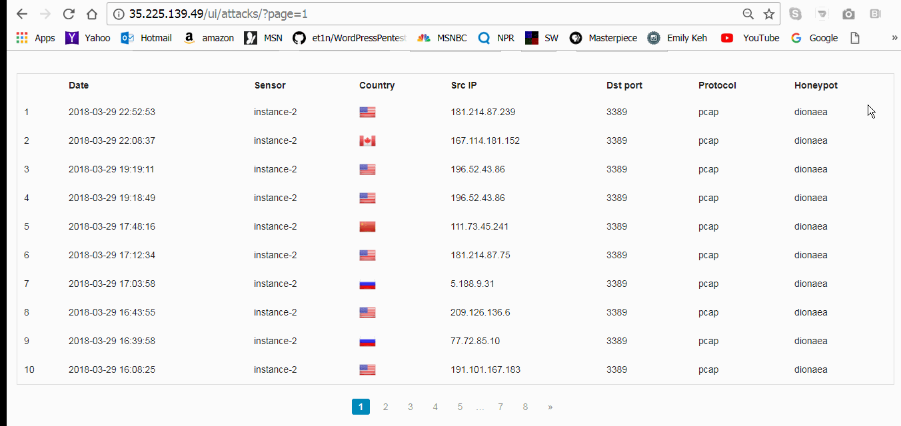
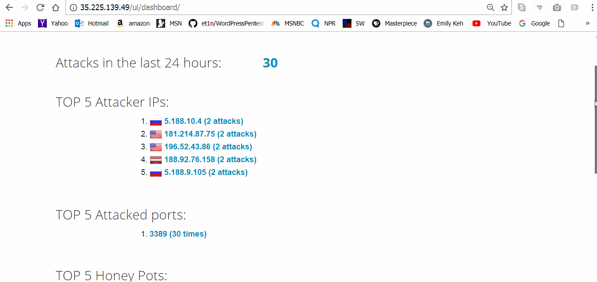

# HoneyPot-Week-9
Information gathered from creating a honeypot

1. Which Honeypot(s) you deployed: 

I deployed two honeypots.  One received no attacks and the other received approximately 87 attack. I had them running for 3 days or about 70 hours. The honeypots I choice were dionaea and dionaea with http.  I was also in two different zones, Central1-a, and Central1-c but in the same region Central1

2. Any issues you encountered:

I had a really hard time with the first deployed honeypot.  I tried to create it a number of times but I couldn't get an attack so I created another honeypot in a different zone but in the same region and I got attacked though not as many times as other people in my class.  I don't really understand why that happened.  I also know students who created honeypots that did not get attacked at all even when they left them up for a number of days.

3. A summary of the data collected: number of attacks, number of malware samples, etc.  

I was attacked about 87+ times.  I was attacked most often on port 3389 though that changed throughout the course of the time the honeypot was up.  Initially, it was port 443 that was attacked most. Most of my attacks came from the US which surprised me.

4. Any unresolved questions raised by the data collected: 

The only questions I have are the following.
How do the attackers find the honeypots so quickly?
Why are some honeypots attacked relentlessly and others not at all.

Additionally, include a json export of the data you collected in the repo, instructions for which can be found in the next section.

Additionally, include a json export of the data you collected in the repo, instructions for which can be found in the next section.

"source_ip" : "5.188.10.21", "source_port" : 46563, "destination_port" : 3389, "identifier" : "631755ba-3236-11e8-8cb1-42010a800003", "honeypot" : "dionaea" }
{ "_id" : { "$oid" : "5abbd0322756dd1027f123b0" }, "protocol" : "pcap", "hpfeed_id" : { "$oid" : "5abbd0302756dd1027f123af" }, "timestamp" : { "$date" : "2018-03-28T17:26:08.602+0000" }, "source_ip" : "181.214.87.75", "source_port" : 56940, "destination_port" : 3389, "identifier" : "631755ba-3236-11e8-8cb1-42010a800003", "honeypot" : "dionaea"}
{ "_id" : { "$oid" : "5abbd0712756dd1027f123b2" }, "protocol" : "pcap", "hpfeed_id" : { "$oid" : "5abbd06e2756dd1027f123b1" }, "timestamp" : { "$date" : "2018-03-28T17:27:10.535+0000" }, "source_ip" : "77.72.85.25", "source_port" : 44614, "destination_port" : 3389, "identifier" : "631755ba-3236-11e8-8cb1-42010a800003", "honeypot" : "dionaea" }
{ "_id" : { "$oid" : "5abbd3692756dd1027f123b4" }, "protocol" : "pcap", "hpfeed_id" : { "$oid" : "5abbd3682756dd1027f123b3" }, "timestamp" : { "$date" : "2018-03-28T17:39:52.307+0000" }, "source_ip" : "77.72.85.25", "source_port" : 45328, "destination_port" : 3389, "identifier" : "631755ba-3236-11e8-8cb1-42010a800003", "honeypot" : "dionaea" }
{ "_id" : { "$oid" : "5abbe4bb2756dd1027f123b6" }, "protocol" : "pcap", "hpfeed_id" : { "$oid" : "5abbe4ba2756dd1027f123b5" }, "timestamp" : { "$date" : "2018-03-28T18:53:46.734+0000" }, "source_ip" : "185.143.223.90", "source_port" : 41564, "destination_port" : 3389, "identifier" : "631755ba-3236-11e8-8cb1-42010a800003", "honeypot" : "dionaea" }
{ "_id" : { "$oid" : "5abbf3902756dd1027f123b8" }, "protocol" : "pcap", "hpfeed_id" : { "$oid" : "5abbf38e2756dd1027f123b7" }, "timestamp" : { "$date" : "2018-03-28T19:57:02.991+0000" }, "source_ip" : "185.156.177.9", "source_port" : 45669, "destination_port" : 3389, "identifier" : "631755ba-3236-11e8-8cb1-42010a800003", "honeypot" : "dionaea"}
{ "_id" : { "$oid" : "5abbf7452756dd1027f123ba" }, "protocol" : "pcap", "hpfeed_id" : { "$oid" : "5abbf7422756dd1027f123b9" }, "timestamp" : { "$date" : "2018-03-28T20:12:50.851+0000" }, "source_ip" : "196.52.43.108", "source_port" : 10397, "destination_port" : 3389, "identifier" : "631755ba-3236-11e8-8cb1-42010a800003", "honeypot" : "dionaea"}
{ "_id" : { "$oid" : "5abbf78a2756dd1027f123bc" }, "protocol" : "pcap", "hpfeed_id" : { "$oid" : "5abbf7882756dd1027f123bb" }, "timestamp" : { "$date" : "2018-03-28T20:14:00.218+0000" }, "source_ip" : "196.52.43.108", "source_port" : 35294, "destination_port" : 3389, "identifier" : "631755ba-3236-11e8-8cb1-42010a800003", "honeypot" : "dionaea"}
{ "_id" : { "$oid" : "5abbfb932756dd1027f123be" }, "protocol" : "pcap", "hpfeed_id" : { "$oid" : "5abbfb922756dd1027f123bd" }, "timestamp" : { "$date" : "2018-03-28T20:31:14.927+0000" }, "source_ip" : "212.48.93.196", "source_port" : 45161, "destination_port" : 3389, "identifier" : "631755ba-3236-11e8-8cb1-42010a800003", "honeypot" : "dionaea"}
{ "_id" : { "$oid" : "5abc12442756dd1027f123c0" }, "protocol" : "pcap", "hpfeed_id" : { "$oid" : "5abc12422756dd1027f123bf" }, "timestamp" : { "$date" : "2018-03-28T22:08:02.303+0000" }, "source_ip" : "194.28.112.48", "source_port" : 65534, "destination_port" : 3389, "identifier" : "631755ba-3236-11e8-8cb1-42010a800003", "honeypot" : "dionaea"}
kehcat@instance-2:~$ ^C
